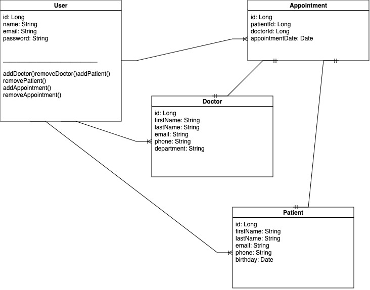
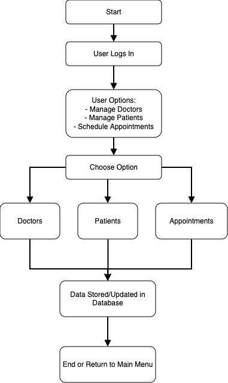

# Universal Clinic

### Clinic Management System Overview

## Purpose
The Clinic Management System is developed to streamline the operations of a healthcare facility by automating the management of doctors, patients, and appointments. It enhances the efficiency of administrative tasks and improves the patient care process.

## Technology Stack
- **Spring Boot**: Utilized as the primary framework for creating the backend, facilitating rapid development, ease of deployment, and out-of-the-box configurations.
- **Java**: Serves as the programming language, offering robustness, object-oriented capabilities, and widespread industry support.
- **MySQL**: Used as the relational database management system to store and manage all data securely and efficiently.

## Key Features

### 1. User Management
- **Registration and Authentication**: Users can register and log in to the system. Each user has a secure profile managed by the system.
- **Profile Management**: Users can update their personal information and manage their passwords.

### 2. Doctor Management
- **Doctor Profiles**: Admins can add, update, or remove doctor profiles, which include details such as name, specialty, contact information, and availability.
- **Schedule Management**: Doctors can view and manage their appointment schedules.

### 3. Patient Management
- **Patient Registration**: Patients can be registered in the system with details like name, contact info, and medical history.
- **Patient Records Access**: Patients can access their medical records and appointment histories.

### 4. Appointment Scheduling
- **Booking Appointments**: Patients can book appointments with available doctors.
- **Appointment Modifications**: Appointments can be rescheduled or canceled either by the patient or the healthcare provider.

## System Entities

- **User**: Core entity representing system users, including administrative staff, doctors, and potentially patients.
- **Doctor**: A specialized user with additional attributes like department and qualifications. Linked to Users and Appointments.
- **Patient**: Represents patients within the system, containing personal and medical details. Linked to Users for authentication.
- **Appointment**: Connects patients and doctors, containing details about the appointment time, doctor, and patient involved.

## Benefits

- **Efficiency**: Automates routine tasks, reducing the workload on staff and minimizing human error.
- **Accessibility**: Centralizes data management, making information easily accessible to authorized users.
- **Scalability**: Built using Spring Boot and MySQL, the system is scalable and can handle growing data needs and user numbers.

## Conclusion
This Clinic Management System is an essential tool for improving the operational efficiency of healthcare facilities. By leveraging modern technologies like Spring Boot and MySQL, it ensures robust performance, security, and user-friendly experiences.

## Diagrams

# Class Diagram Description

## User

- **Attributes**:
    - `name`: String
    - `email`: String
    - `password`: String
- **Relationships**:
    - One-to-many with `Doctor`
    - One-to-many with `Patient`
    - One-to-many with `Appointment`
- **Methods**:
    - `addDoctor(Doctor doctor)`: Adds a doctor to the user's list.
    - `removeDoctor(Doctor doctor)`: Removes a doctor from the user's list.
    - `addPatient(Patient patient)`: Adds a patient to the user's list.
    - `removePatient(Patient patient)`: Removes a patient from the user's list.
    - `addAppointment(Appointment appointment)`: Adds an appointment to the user's list.
    - `removeAppointment(Appointment appointment)`: Removes an appointment from the user's list.

## Doctor

- **Attributes**:
    - `firstName`: String
    - `lastName`: String
    - `email`: String
    - `phone`: String
    - `department`: String
- **Relationships**:
    - Many-to-one with `User`

## Patient

- **Attributes**:
    - `firstName`: String
    - `lastName`: String
    - `email`: String
    - `phone`: String
    - `birthday`: Date
- **Relationships**:
    - Many-to-one with `User`

## Appointment

- **Attributes**:
    - `patientId`: Long
    - `doctorId`: Long
    - `appointmentDate`: Date
- **Relationships**:
    - Many-to-one with `User`

### Class Diagram Representation

# Key Processes to Include in the Functional Diagram

## User Registration and Login

- **Registration**: Users can register by entering personal details such as name, email, and password. The system verifies these credentials and performs necessary security checks.
- **Login**: Users log in to the system by providing their verified credentials, which are authenticated to grant access.

## Doctor Management

- **Adding a Doctor**: Administrators can add doctors to the system, entering information such as name, department, and contact details.
- **Editing Doctor Details**: Doctor information can be updated by authorized users to reflect changes in details like phone numbers or specialties.
- **Removing a Doctor**: Doctors can be removed from the system when they are no longer affiliated with the clinic.

## Patient Management

- **Registering a New Patient**: New patients are registered in the system with their details including name, contact information, and medical history.
- **Updating Patient Information**: Existing patient information can be updated to keep records current, such as contact details or medical conditions.
- **Removing a Patient**: Patients can be removed from the system database when necessary.

## Appointment Scheduling

- **Creating an Appointment**: Patients or healthcare providers can schedule appointments, specifying the doctor, time, and date.
- **Viewing Appointment Details**: Details of scheduled appointments can be viewed to check the timing, doctor assigned, and other relevant information.
- **Modifying or Rescheduling an Appointment**: Appointments can be modified or rescheduled to accommodate changes in availability or patient needs.
- **Canceling an Appointment**: Appointments can be canceled if they are no longer needed or if conflicts arise.

## Data Access and Management

- **User Profile Access**: Users can access their profiles to view or update their personal details.
- **Doctor Schedule Access**: Doctors can view their schedules to see upcoming appointments and manage their time.
- **Patient Medical History Access**: Patients can view their medical history and details of upcoming appointments, facilitating better health management.

### Functional Diagram (Flowchart)

